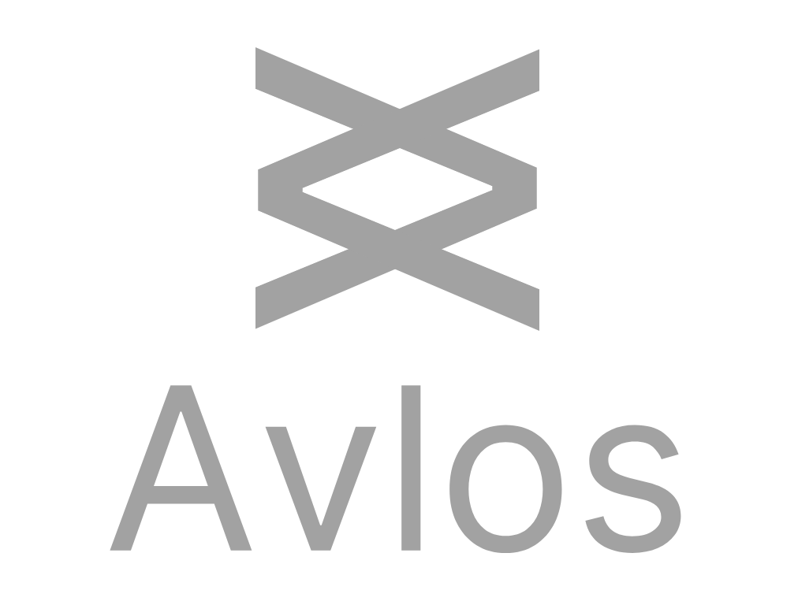
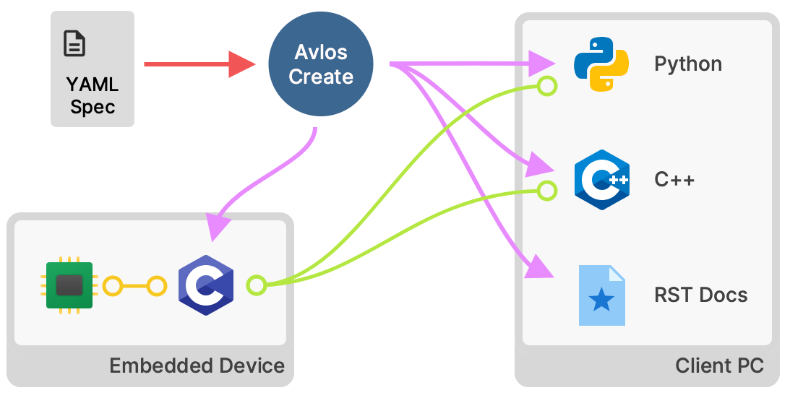

   

[Αυλός (Avlόs)](https://en.wikipedia.org/wiki/Aulos), _flute_, also _channel_.

Avlos makes it easy to create protocol implementations to communicate with remote embedded devices.

Given a remote embedded device, a client that wants to talk with the device, and a YAML file that represents the remote device structure that we want exposed to the client (the spec), Avlos will generate a protocol implementation based on the spec. It will also generate documentation and more. 

Avlos has been originally developed as a communication layer for [Tinymovr](https://tinymovr.com)

[Documentation](docs/index.rst)

## :bulb: Illustrative Use Case

Let's make a protocol to control a toaster. First we generate a spec file containing the structure we want the toaster to expose:

    name: toaster
    remote_attributes:
    - name: sn
        dtype: uint32
        getter_name: toaster_get_sn
        summary: The unique device serial number.
    - name: heater
      remote_attributes:
      - name: temperature
          dtype: float
          unit: celsius
          getter_name: toaster_get_heater_temp
          summary: The toaster heater temperature.
    - name: relay
      remote_attributes:
      - name: relay_state
          dtype: bool
          getter_name: toaster_get_relay_state
          setter_name: toaster_set_relay_state
          summary: The toaster heating relay element state.

Given the above, Avlos can generate the following:

- C implementation of the spec, to be included in the device firmware. The implementation offers data validation, (de-)serialization, getter/setter function calls, and a entry function to call with channel data. The actual comms channel implementation is left to the user.

- A Python object reflecting the spec, to be used in the client. The object includes data validation, (de-)serialization, units integration and pretty presentation. The root node needs a comms channel to realize communication with a remote device.

- RestructuredText-based documentation for each endpoint.

- [CAN DBC file](https://www.csselectronics.com/pages/can-dbc-file-database-intro) (CAN database), for every endpoint, for use with CAN-based comm channels.

In addition, Avlos will compute a checksum for the spec and add it as a variable to the implementation so that it can be retrieved by the client for comparing client and device specs. 

The output location, as well as many other attributes of the files are flexible and easily configurable.

## :gift: Installation

    pip install avlos

## :gear: Project Configuration

### Device Spec

The Device Spec is a YAML file that defines how the device is structured. It consists of a tree-like structure. For an example of Spec file see the [tests/definition/good_device.yaml](./tests/definition/good_device.yaml) file.

### Output Config

The output config defines the output modules that will be used and their options. Example, showing C code generation for embedded devices:

    generators:
        generator_c:
            enabled: true
            paths:
                output_header: outputs/header.h
                output_impl: outputs/header.c
            header_includes:
            - src/header.h
            impl_includes:
            - src/test.h

## :zap: Usage

Ensure a device spec and an output config exist in the current folder.

    avlos from file device.yaml

This will generate the outputs according to the configuration in the output config file.

## Example Project

A complete project example using Avlos is available at [example/](./example). Note that all the output paths defined in the output config are relative to that file. In contrast, includes are parsed as is.

## :gem: Available Generators

- __generator_c__: C Embedded Code
- __generator_cpp__: C++ Client Code
- __generator_rst__: RST-based Docs
- __generator_dbc__: CAN Bus Database Format

In addition, the object resulting from the deserialization of the spec can be used as a Python object for RPC, by supplying a channel as follows:

    import yaml
    from avlos import deserialize
    from myProject import myChannel # update this
    
    device_description = ...
    obj = deserialize(yaml.safe_load(device_description))
    obj.set_channel(myChannel())

The `myChannel` class is a subclass of `BaseChannel` that needs to implements `recv`, `send`, `max_ep_id`, `max_packet_size` and `serializer`. The abstract `BaseChannel` class is defined in [channel.py](avlos/channel.py).

## :memo: Various Notes

### Avlos offers:

- A simple straightforward tree structure description, sufficient for most device types out there
- A flexible templating system with several built-in generators, and a simple unassuming system to extend
- Tight integration with physical units through the Pint module.

### Avlos does not offer:

- An implementation of the comms channel, this is left to the user.
- Segmentation of data into packets (this is planned)

- The Avlos_Command enum is structured so as to be compatible with CAN bus RTR field (i.e. 0 -> write, 1 -> read)
- Even though Avlos generators generate a protocol hash for both device-side (as a variable) and client-side implementations (as an object attribute), the way the hash is retrieved/checked/enforced is not included. This is due to the fact that each comms channel may implement different means of performing the above.

## :key: License

MIT

